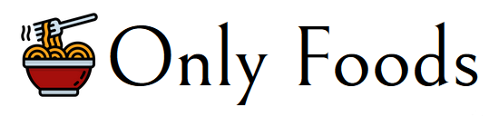

[![Contributors][contributors-shield]][contributors-url]
[![Forks][forks-shield]][forks-url]
[![Stargazers][stars-shield]][stars-url]
[![Issues][issues-shield]][issues-url]
[![MIT License][license-shield]][license-url]

<!-- PROJECT LOGO -->
<br />
<div align="center">
  

  <h3 align="center">Only Foods - Front End</h3>

  <p align="center">
    This is the front end of the Only Foods project, a web application that allows users to share thoughts, recipes, and chat with each other about food.
    <br />
    <strong>Status: <u>In development</u></strong>
    <br />
    <a href="https://github.com/TiagoRibeiro25/Only-Foods-Docs"><strong>Explore the docs »</strong></a>
    <br />
    <br />
    <a href="https://onlyfoods.netlify.app/">View Demo</a>
    ·
    <a href="https://github.com/TiagoRibeiro25/Only-Foods-FE/issues">Report Bug</a>
    ·
    <a href="https://github.com/TiagoRibeiro25/Only-Foods-FE/issues">Request Feature</a>
  </p>
</div>

<!-- TABLE OF CONTENTS -->
<details>
  <summary>Table of Contents</summary>
  <ol>
    <li>
      <a href="#about-the-project">About The Project</a>
      <ul>
        <li><a href="#built-with">Built With</a></li>
      </ul>
    </li>
    <li>
      <a href="#getting-started">Getting Started</a>
      <ul>
        <li><a href="#prerequisites">Prerequisites</a></li>
        <li><a href="#installation">Installation</a></li>
       <li><a href="#prepare-for-production">Prepare for production</a></li>
      </ul>
    </li>
   <li><a href="#documentation">Documentation</a></li>
    <li><a href="#contributing">Contributing</a></li>
    <li><a href="#license">License</a></li>
    <li><a href="#contact">Contact</a></li>
  </ol>
</details>

<!-- ABOUT THE PROJECT -->
## About The Project

[![Product Name Screen Shot][product-screenshot]](https://onlyfoods.netlify.app/)

Only Foods is a web application that allows users to share thoughts, recipes, and chat with each other about food.

This project was made as a side project to elevate my skills in React, Typescript and WebSockets. It was made fully alone, from the design to the deployment.

### Built With

* [React](https://react.dev/)
* [React Router](https://reactrouter.com/)
* [Typescript](https://www.typescriptlang.org/)
* [Tailwindcss](https://tailwindcss.com/)
* [Socket.io](https://socket.io/)
* [Framer Motion](https://www.framer.com/motion/)
* [Vite](https://vitejs.dev/)

<!-- GETTING STARTED -->
## Getting Started

To get a local copy up and running follow these simple steps.

### Prerequisites

In order to run this project, you need to have installed

* Nodejs
* npm

You also need to have this [API](https://github.com/TiagoRibeiro25/Only-Foods-BE) running locally.

### Installation

1. Clone the repo

   ```sh
   git clone https://github.com/TiagoRibeiro25/Only-Foods-FE.git
   ```

2. Install NPM packages

   ```sh
   npm install
   ```

3. Create a .env file, add the variables in the .env.sample file and fill them with your own values. The .env file should have the following variables:

   ```js
   VITE_API_ROUTE
   ```

4. Run the project

   ```sh
   npm run dev
   ```

<!-- Production -->
## Prepare for production

1. Install NPM packages (if you haven't already)

   ```sh
   npm install
   ```

2. Build the project

   ```sh
   npm run build
   ```

3. All the files needed for production will be in the dist folder. You can serve them with any server you want. If you want to serve them with nodejs, you can use the following command:

   ```sh
   npm install -g serve
   serve -s dist
   ```

<!-- Documentation -->
## Documentation

All the documentation can be found [here](https://github.com/TiagoRibeiro25/Only-Foods-Docs).

<!-- CONTRIBUTING -->
## Contributing

Contributions are what make the open source community such an amazing place to learn, inspire, and create. Any contributions you make are **greatly appreciated**.

If you have a suggestion that would make this better, please fork the repo and create a pull request. You can also simply open an issue with the tag "enhancement".

1. Fork the Project
2. Create your Feature Branch (`git checkout -b feature/AmazingFeature`)
3. Commit your Changes (`git commit -m 'Add some AmazingFeature'`)
4. Push to the Branch (`git push origin feature/AmazingFeature`)
5. Open a Pull Request

<!-- LICENSE -->
## License

Distributed under the MIT License. See `LICENSE.txt` for more information.

<!-- CONTACT -->
## Contact

Contact section of my personal website:
[tiagoribeiro.tech](https://tiagoribeiro.tech/)

<!-- MARKDOWN LINKS & IMAGES -->
[contributors-shield]: https://img.shields.io/github/contributors/TiagoRibeiro25/Only-Foods-FE.svg?style=for-the-badge
[contributors-url]: https://github.com/TiagoRibeiro25/Only-Foods-FE/graphs/contributors
[forks-shield]: https://img.shields.io/github/forks/TiagoRibeiro25/Only-Foods-FE.svg?style=for-the-badge
[forks-url]: https://github.com/TiagoRibeiro25/Only-Foods-FE/network/members
[stars-shield]: https://img.shields.io/github/stars/TiagoRibeiro25/Only-Foods-FE.svg?style=for-the-badge
[stars-url]: https://github.com/TiagoRibeiro25/Only-Foods-FE/stargazers
[issues-shield]: https://img.shields.io/github/issues/TiagoRibeiro25/Only-Foods-FE.svg?style=for-the-badge
[issues-url]: https://github.com/TiagoRibeiro25/Only-Foods-FE/issues
[license-shield]: https://img.shields.io/github/license/TiagoRibeiro25/Only-Foods-FE.svg?style=for-the-badge
[license-url]: https://github.com/TiagoRibeiro25/Only-Foods-FE/blob/master/LICENSE.txt
[product-screenshot]: images/screenshot.png
